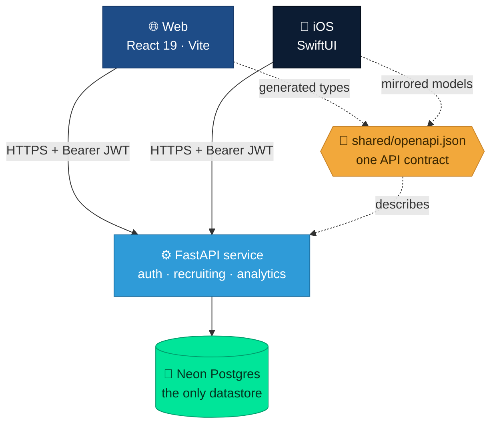

<div align="center">

# 🎖️ AFROTC Detachment 695 — Recruiting Platform

**One product, three surfaces, one database.** A recruiting and cadet-management
platform for **AFROTC Detachment 695** (University of Portland), covering the
Pacific Northwest.


</div>

| Surface | Stack | Directory |
|---|---|---|
| **Backend** | FastAPI · SQLAlchemy 2.0 · Neon Postgres | [`backend/`](backend/) |
| **Web** | React 19 · TypeScript · Vite · Vercel | [`web/`](web/) |
| **iOS** | SwiftUI · XcodeGen | [`ios/`](ios/) |

All three talk to the **same Neon Postgres database through the same API
contract** ([`shared/openapi.json`](shared/openapi.json)) — a data edit shows up
everywhere at once. Full documentation is in the
**[project wiki](https://github.com/drewdog88/afrotc-native-ios/wiki)**.



## Quickstart

Run all three locally (backend on 8099 so the iOS simulator finds it):

```bash
# 1. Backend  (needs a Neon DATABASE_URL — there is no local DB fallback)
cd backend && cp .env.example .env      # set DATABASE_URL, SECRET_KEY, ENCRYPTION_KEY, BOOTSTRAP_ADMIN_PASSWORD
uv sync --extra dev
uv run alembic upgrade head             # create schema (direct, non-pooled host)
uv run uvicorn app.main:app --reload --port 8099

# 2. Web
cd web && npm install && npm run dev     # http://localhost:5173

# 3. iOS
cd ios && xcodegen generate && open Det695.xcodeproj   # ⌘R
```

Log in with the demo admin `admin` / `Det695Demo!`.

## Documentation

| Page | What it covers |
|---|---|
| [Architecture](https://github.com/drewdog88/afrotc-native-ios/wiki/Architecture) | How the three surfaces fit together |
| [Backend API](https://github.com/drewdog88/afrotc-native-ios/wiki/Backend-API) | FastAPI service, endpoints, auth, config |
| [Web App](https://github.com/drewdog88/afrotc-native-ios/wiki/Web-App) · [iOS App](https://github.com/drewdog88/afrotc-native-ios/wiki/iOS-App) | The two clients |
| [Database](https://github.com/drewdog88/afrotc-native-ios/wiki/Database) | Neon Postgres, schema, migrations, seeding |
| [Backups & Recovery](https://github.com/drewdog88/afrotc-native-ios/wiki/Backups-and-Recovery) · [`BACKUP.md`](BACKUP.md) | Nightly dumps, restore drill, runbook |
| [Deployment](https://github.com/drewdog88/afrotc-native-ios/wiki/Deployment) | How web + API ship to Vercel |
| [Development Process](https://github.com/drewdog88/afrotc-native-ios/wiki/Development-Process) · [Testing](https://github.com/drewdog88/afrotc-native-ios/wiki/Testing) · [Roadmap](https://github.com/drewdog88/afrotc-native-ios/wiki/Roadmap) | Working on it |

## Ground rules

- **Neon Postgres is the only runtime datastore** — no local/SQLite fallback.
- **Data is real and Pacific-Northwest** — never seed out-of-region records.
- **Secrets never land in the repo** — `.env` locally; Vercel / GitHub Actions
  secrets in the cloud.

## Repository layout

```
backend/   FastAPI service, models, Alembic migrations, scripts, tests
web/       React + TypeScript + Vite app (deploys to Vercel)
ios/       SwiftUI app (XcodeGen-generated project)
shared/    openapi.json — the contract both clients build against
wiki/      documentation source (synced to the GitHub Wiki)
.github/   backup + restore-drill workflows
BACKUP.md  disaster-recovery runbook
```
