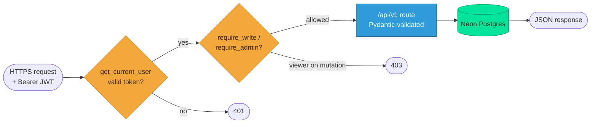

<div align="center">

# ⚙️ AFROTC Det 695 — Backend (FastAPI)

**Headless JSON API that powers both the React web app and the SwiftUI iOS app.**


</div>

## Stack
FastAPI · SQLAlchemy 2.0 · Alembic · Pydantic v2 · JWT (python-jose) · bcrypt · pyotp (TOTP) · Neon PostgreSQL.

## Request lifecycle



## Quickstart

```bash
cd backend
cp .env.example .env          # then edit DATABASE_URL (Neon), SECRET_KEY, ENCRYPTION_KEY, BOOTSTRAP_ADMIN_PASSWORD
uv sync --extra dev           # create venv + install deps
uv run alembic upgrade head   # create the schema (against the direct, non-pooled Neon host)
uv run uvicorn app.main:app --reload --port 8000
```

Open http://localhost:8000/docs for the interactive OpenAPI docs.

**Postgres only — no local/SQLite fallback.** `DATABASE_URL` must be a
`postgresql` URL (the config validator rejects anything else). The schema is owned
entirely by Alembic; the app never auto-creates tables. See the
[Database wiki page](https://github.com/drewdog88/afrotc-native-ios/wiki/Database).

## Layout
```
app/
  core/       config, database, security (hashing/JWT/encryption)
  models/     SQLAlchemy 2.0 ORM models
  api/v1/     route modules (auth, recruits, cadets, contacts, events, …)
  bootstrap.py first-run admin seed
  main.py     FastAPI app + health
tests/        95 pytest tests over an in-memory SQLite harness
```

## Tests

```bash
uv run pytest -q        # 95 passing — every /api/v1 module
uv run ruff check .     # lint
```

The suite runs against an in-memory SQLite database (via a `get_db` override in
`tests/conftest.py`), so no live Postgres is needed. See the
[Testing wiki page](https://github.com/drewdog88/afrotc-native-ios/wiki/Testing).
