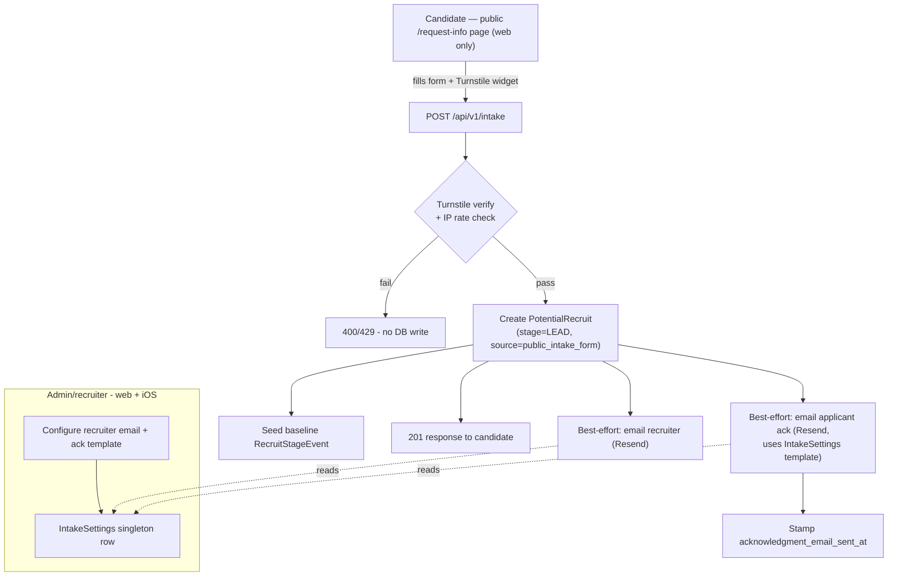

# Public "Request Information" Intake Form — Design

**Date:** 2026-08-23
**Status:** Approved
**Scope:** A public, unauthenticated intake form for prospective AFROTC cadets
to express interest, feeding directly into the existing recruiting funnel
(`PotentialRecruit`, `stage=LEAD`), plus admin-configurable notification/
acknowledgment settings (web + iOS parity) and spam protection.

## Goal

Give prospective recruits a way to self-submit interest without logging in
(there is no public-facing page in this product today — the entire web app is
auth-gated behind `/login`). A submission must:

1. Create a lead in the existing recruiting pipeline (no new "opportunities"
   table — `PotentialRecruit` already *is* the funnel entity, entering at
   `stage=LEAD`).
2. Notify an internal recruiter by email.
3. Send the applicant an acknowledgment email, using a template an admin can
   edit (subject + body), without a code change.
4. Resist bot spam via Cloudflare Turnstile plus a lightweight IP rate limit.
5. Never surface a downstream failure (email/Turnstile-adjacent) as an error
   to the applicant once their data is safely recorded.

## Non-goals (explicitly deferred)

- Admin-configurable branding/logo (discussed previously, never built —
  the page uses the existing static logo asset, no new admin control).
- A generic key-value settings framework (this codebase has none; we add a
  single purpose-built table instead — see below).
- Deduplication on resubmission — every submission creates a new
  `PotentialRecruit` row; recruiters already triage the pipeline manually.
- The intake form itself on iOS — candidates never use the iOS app. Only the
  *admin* settings for this feature get iOS parity.

## Architecture & request flow



Key property: **the DB write is the source of truth and happens before any
email attempt.** Turnstile/rate-limit failures reject before touching the DB;
email failures (Resend outage, misconfigured template) are caught and logged
but never turn an already-successful submission into an error response.

## Data model changes

New enums in `app/models/enums.py`:

```python
class GradeLevel(StrEnum):
    HS_9 = "hs_9"
    HS_10 = "hs_10"
    HS_11 = "hs_11"
    HS_12 = "hs_12"
    COLLEGE_FRESHMAN = "college_freshman"
    COLLEGE_SOPHOMORE = "college_sophomore"
    COLLEGE_JUNIOR = "college_junior"
    COLLEGE_SENIOR = "college_senior"
    OTHER = "other"  # GED, community college, non-standard path

class IntendedTerm(StrEnum):
    FALL = "fall"
    SPRING = "spring"
```

Extend the existing `SchoolType` enum with one new member so `OTHER`-grade
leads have a truthful school type (the column is `NOT NULL`):

```python
class SchoolType(StrEnum):
    HIGH_SCHOOL = "high_school"
    COLLEGE = "college"
    OTHER = "other"  # GED / community college / non-standard path
```

New columns on `PotentialRecruit` (`app/models/recruit.py`), all
nullable/defaulted so the existing authenticated `create_recruit` flow and
existing rows are unaffected:

| Column | Type | Notes |
|---|---|---|
| `grade_level` | `String(20)`, nullable | values from `GradeLevel`; `school_type` is derived server-side: `HS_*` → `high_school`, `COLLEGE_*` → `college`, `OTHER` → `SchoolType.OTHER` (new enum value — GED / community-college / non-standard paths must not be silently mislabeled as college; the existing `school_type` column is `NOT NULL` with a default, so a real value is required, hence the new enum member rather than null). The form asks one grade question, not a separate school-type question |
| `intended_entry_term` | `String(10)`, nullable | `fall` / `spring` |
| `intended_entry_year` | `Integer`, nullable | |
| `consent_given_at` | `DateTime(timezone=True)`, nullable | stamped when the applicant checks the contact-consent box; `null` = never given |
| `acknowledgment_email_sent_at` | `DateTime(timezone=True)`, nullable | set once the "thank you" email actually sends |
| `source` | `String(20)`, default `"manual"` | `"public_intake_form"` for these, `"manual"` for staff-entered, for reporting |
| `source_ip` | `String(45)`, nullable | IPv4/IPv6; used for the rate-limit check and abuse triage only |

`current_school` stays required, collected as free text on the form — same
requirement the model already has today.

New table, `intake_settings` — single row, `id` fixed to `1`:

```python
class IntakeSettings(Base, TimestampMixin):
    __tablename__ = "intake_settings"
    id: Mapped[int] = mapped_column(primary_key=True, default=1)
    recruiter_notification_email: Mapped[str | None] = mapped_column(String(120), nullable=True)
    ack_email_subject: Mapped[str] = mapped_column(String(200), default="Thanks for your interest in AFROTC Detachment 695")
    ack_email_body: Mapped[str] = mapped_column(Text, default="<default thank-you copy>")
```

Seeded with sensible defaults via the same bootstrap mechanism that seeds the
admin user (`app/bootstrap.py`), so the feature works before an admin ever
visits the settings screen.

One Alembic migration covers both the new columns and the new table.

## Backend API surface

New public router `app/api/v1/intake.py`, mounted with **no auth dependency**:

```
POST /api/v1/intake          — public, creates a lead
GET  /api/v1/intake/options   — public, returns GradeLevel/IntendedTerm values
                                  + display labels (frontend doesn't hardcode them)
```

`POST /api/v1/intake` request body (`IntakeCreate` schema): `first_name`,
`last_name`, `email`, `phone`, `current_school`, `grade_level`,
`intended_entry_term`, `intended_entry_year`, `consent` (bool, must be `true`
or `422`), `turnstile_token` (str).

Handler flow:

1. Verify `turnstile_token` against Cloudflare's siteverify API (secret key
   from new `settings.turnstile_secret_key`). Failure → `400`, no DB write.
2. Rate-limit — **loose backstop only; Turnstile is the primary bot defense.**
   Count `potential_recruit` rows with `source_ip = <request IP>` and
   `created_at` in the last hour; reject `429` only above a deliberately high
   threshold (e.g. **30/hour**). This is set well above any real recruiting
   event: a table at a school fair or a class signing up on shared school
   WiFi all share one NAT'd IP, so a low per-hour cap would reject legitimate
   recruits — exactly the audience we want. Turnstile stops the bots; this cap
   only catches a runaway flood. No new infra — reuses Postgres, matching this
   repo's "no Redis / no local fallback" posture.
3. Create `PotentialRecruit` (`stage=LEAD`, `source="public_intake_form"`,
   `consent_given_at=now`, `source_ip=<request IP>`); seed baseline
   `RecruitStageEvent` (`changed_by_id=None`, already nullable).
4. Commit — the durable write. Everything after this is best-effort and
   exception-guarded so it can never turn a successful submission into an
   error response.
5. If `intake_settings.recruiter_notification_email` is set, send the
   internal notification email via Resend. Missing config or send failure:
   log and continue.
6. Send the applicant acknowledgment email using
   `ack_email_subject`/`ack_email_body`, substituting `{{first_name}}`, then
   stamp `acknowledgment_email_sent_at`. Same best-effort handling. **The email
   is plain text** (not HTML): it keeps the admin template editor simple,
   sidesteps HTML-injection from the applicant-controlled `first_name`, and
   still supports links (mail clients auto-linkify URLs). Substituted values
   are inserted as-is into plain text — no markup to escape. Both emails are
   sent from `settings.resend_from_email`.
7. Return `201` with a minimal confirmation payload — no internal IDs or
   pipeline/stage info leaked publicly.

Admin settings, added to the existing `app/api/v1/admin.py`
(already `require_admin`-gated):

```
GET /api/v1/admin/intake-settings
PUT /api/v1/admin/intake-settings
```

New service module `app/services/email.py` wrapping the Resend SDK — one
function per email type, used only by `intake.py`.

New `Settings` fields (`app/core/config.py`): `resend_api_key: str = ""`,
`resend_from_email: str = ""` (must be an address on a domain verified in
Resend — see Rollout), `turnstile_secret_key: str = ""`. Turnstile's *site key*
(public) lives in the web app's Vite env, not backend settings.

### Two architectural choices made explicitly

1. **Dedicated `intake` module**, not a public route bolted onto
   `recruits.py`. Keeps the "unauthenticated, must survive abuse" surface
   isolated from the authenticated internal CRUD surface — easier to reason
   about and harden independently. (Rejected: a separate microservice/
   deployment for one form — pure overkill.)
2. **Purpose-built `IntakeSettings` table**, not a generic key-value
   `Setting(key, value)` table. This codebase has no generic settings
   framework today; introducing one would be new infrastructure for a
   problem this feature doesn't actually have. (Typed columns also make the
   admin API/schema trivial.)

## Frontend — web

- New page `web/src/pages/RequestInfo.tsx` + `.module.css`, rendered
  **outside** `AppShell`/`RequireAuth`, as a standalone route in `main.tsx`
  alongside `/login`:
  ```tsx
  <Route path="/request-info" element={<RequestInfo />} />
  ```
- Form fields: first/last name, email, phone, current school (text),
  grade-level select, term+year select, consent checkbox, Turnstile widget,
  submit. Fetches `/api/v1/intake/options` on mount for the two dropdowns.
- **CSP change required (`vercel.json`).** The current Content-Security-Policy
  is `script-src 'self'` with no `frame-src` (so frames fall back to
  `default-src 'self'`). Cloudflare Turnstile loads a script from and injects
  an iframe from `https://challenges.cloudflare.com`; under the current policy
  **both are blocked and the widget silently fails to render.** Add
  `https://challenges.cloudflare.com` to both `script-src` and a new
  `frame-src` directive. This is a required task, not optional polish — the
  form is unusable without it.
- Success state replaces the form with a thank-you message in place (no
  redirect — there's no dashboard to send an unauthenticated visitor to).
- Displays the existing static logo asset (`web/src/assets/det695-patch.png`
  or similar) — no new admin branding control (see Non-goals).
- `web/src/lib/api.ts` gets one new unauthenticated call (`submitIntake`) —
  everything else in that client assumes a bearer token, so this is a small,
  explicit exception rather than a client-wide refactor.
- **`Admin.tsx`**: new tab/section "Request-Info Settings" — recruiter email
  input + subject/body template editor (plain textareas, a note listing
  supported placeholders). Uses `GET`/`PUT /admin/intake-settings`.
- **`Recruits.tsx`**: add a CSV download button wired to the existing
  `GET /export/recruits?format=csv` (already built, never exposed in the UI).

## iOS

- Mirror the **admin settings only**: extend `AdminView.swift`/
  `Models/Admin.swift` with the same recruiter-email + template fields,
  calling the same `/admin/intake-settings` endpoint, following the existing
  pattern used there for user management.
- No `/request-info` equivalent on iOS (confirmed out of scope).

## Error handling & resilience

- Turnstile/rate-limit rejection happens strictly before any DB write.
- Once the `PotentialRecruit` row is committed, email sending (recruiter
  notification and applicant acknowledgment) is wrapped in
  try/except-and-log; failures never change the HTTP response already
  promised to the candidate.
- Missing `recruiter_notification_email` config is treated as "notification
  skipped," not an error.

## Testing

- `backend/tests/test_intake.py`: valid submission → `201` + DB row + both
  emails attempted (Resend client mocked); missing consent → `422`; failed
  Turnstile → `400` + no DB row; rate limit exceeded → `429`; email-send
  failure → still `201` (durability guarantee), `acknowledgment_email_sent_at`
  left `null`. Also: `{{first_name}}` substitution renders correctly in the
  plain-text ack body; `grade_level=OTHER` → `school_type="other"` (not
  `college`); `grade_level=hs_11` → `high_school`; `grade_level=college_junior`
  → `college`.
- Extend `backend/tests/test_admin.py` for the new settings `GET`/`PUT`
  (admin-only, `403` for non-admins).
- iOS: follow whatever existing verification pattern covers `AdminView`
  (build-and-drive per this repo's iOS testing convention).

## Rollout

1. Alembic migration (new columns + `intake_settings` table, seeded).
2. **Run the backup/restore drill to confirm it still succeeds against the
   new schema** before considering the migration done.
3. Turnstile: script what's scriptable via Cloudflare's API/CLI; walk through
   whatever genuinely requires the dashboard UI at implementation time. Update
   `vercel.json` CSP (`script-src` + new `frame-src`) to allow
   `https://challenges.cloudflare.com`, and verify the widget actually renders
   on the deployed page (not just locally).
4. Resend: net-new account/integration; no existing email infrastructure in
   this codebase to migrate from. **A sending domain must be verified in
   Resend (DNS records) before any email will send**, and `resend_from_email`
   must be an address on that verified domain — flag this as a setup
   prerequisite, not something discoverable only when the first email
   silently fails.

## Files

**New:**
- `backend/app/api/v1/intake.py`
- `backend/app/schemas/intake.py`
- `backend/app/services/email.py`
- `backend/app/models/settings.py` (holds `IntakeSettings`; one model file
  per concern, matching `recruit.py`/`contact.py`/`content.py`)
- `backend/alembic/versions/<new migration>.py`
- `backend/tests/test_intake.py`
- `web/src/pages/RequestInfo.tsx`, `RequestInfo.module.css`

**Edit:**
- `backend/app/models/enums.py` (`GradeLevel`, `IntendedTerm`)
- `backend/app/models/recruit.py` (new columns)
- `backend/app/api/v1/admin.py` (settings GET/PUT)
- `backend/app/api/v1/router.py` (mount `intake.router`)
- `backend/app/core/config.py` (`resend_api_key`, `resend_from_email`,
  `turnstile_secret_key`)
- `backend/app/bootstrap.py` (seed default `IntakeSettings` row)
- `vercel.json` (CSP: allow `https://challenges.cloudflare.com` in
  `script-src` + new `frame-src`)
- `web/src/main.tsx` (new public route)
- `web/src/lib/api.ts` (`submitIntake`)
- `web/src/pages/Admin.tsx`, `Admin.module.css` (new settings section)
- `web/src/pages/Recruits.tsx` (CSV download button)
- `ios/Det695/Views/AdminView.swift`, `ios/Det695/Models/Admin.swift`
  (new `IntakeSettings`/`IntakeSettingsUpdate` structs alongside the existing
  `AdminUserCreate`/`AdminUserUpdate` ones — same file, same pattern),
  `ios/Det695/Networking/APIClient.swift` (settings parity)
