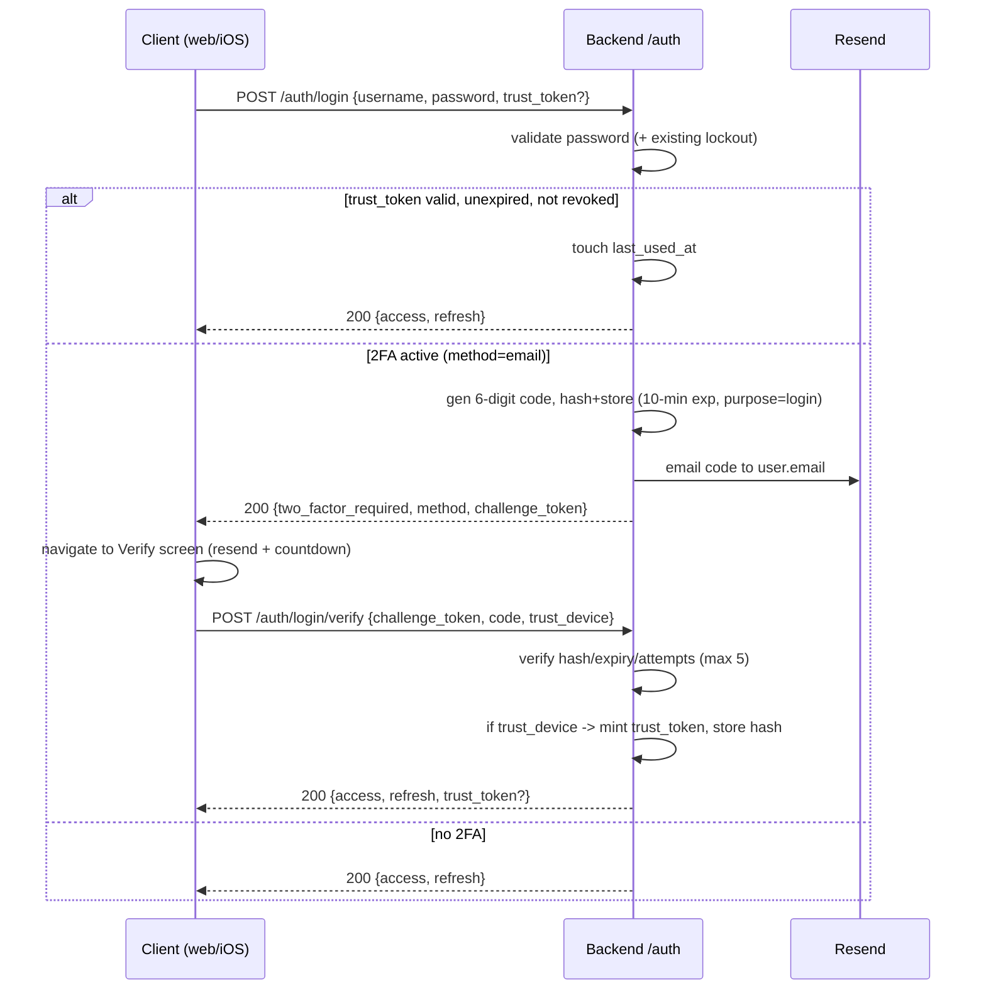

# Email-Based Two-Factor Authentication — Design

**Date:** 2026-08-25
**Branch:** `feature/email-2fa`
**Status:** Design — pending review
**Scope:** Backend + Web + iOS

## Overview

Add opt-in two-factor authentication delivered as a **one-time code emailed
to the user's profile email address**. The feature is built on a
**method-based scaffold** so that authenticator-app TOTP can be added later
as a second method without reworking the login, verification, admin, or
trusted-device machinery. TOTP is explicitly **kept dormant, not removed**.

Delivery is via the existing Resend integration (`app/services/email.py`),
which is already configured in production.

### Goals

- Users can enable email 2FA for their own account (opt-in), confirming
  deliverability by entering a test code before it activates.
- After a user's **first** successful login they are prompted **once** to
  enroll; if they decline, they are never auto-prompted again but can enable
  later from Profile.
- Admins can enable or disable 2FA on any user; enabling is **immediately
  enforced** at that user's next login.
- Users can mark a device as trusted for **30 days**, skipping the email code
  (but never the password) on that device until it expires or is revoked.
- Users manage their trusted devices (list + revoke) from Profile.

### Non-goals (v1)

- Authenticator-app TOTP as an *active* method (scaffold only; dormant).
- Backup / recovery codes (a `backup_codes_hash` column already exists; defer
  its use).
- SMS delivery.
- Per-device geolocation or IP binding.
- "Remember device" is **in scope** (trusted devices, below).

## Key decisions

| Decision | Choice |
|---|---|
| Mechanism | Email one-time code (random, system-generated) |
| Scaffold | Method-based (`email` now, `totp` future); shared enable/challenge/verify/admin/trust paths |
| TOTP | Kept dormant, not deleted |
| First-login enrollment | Prompt **once**; if skipped, never auto-re-prompt |
| Self-enrollment | **Verify a test code first** before activation |
| Admin toggle | Enable is **immediately enforced** next login; admin override skips the test-code round-trip |
| Login UX | **Dedicated verify screen** (code entry + resend + countdown) via a challenge token |
| Trusted device | "Trust this device for 30 days" on verify screen |
| Trust duration | 30 days, fixed (not sliding) |
| Device management | Full: list + per-device revoke + "revoke all others" in Profile |
| Trust auto-revoke | On password change/reset, on 2FA disable, on admin action |
| Clients | Backend + Web + iOS |

## Data model

### `users` — new columns (Alembic migration)

| Column | Type | Notes |
|---|---|---|
| `two_factor_method` | `str \| None` | `null` \| `'email'` \| `'totp'` (future) |
| `two_factor_enabled` | `bool` (default false) | 2FA active for this user |
| `two_factor_enrollment_prompted` | `bool` (default false) | drives ask-once |
| `otp_code_hash` | `str \| None` | hashed pending code (enroll **or** login) |
| `otp_expires_at` | `datetime \| None` | code expiry |
| `otp_attempts` | `int` (default 0) | verify attempts on current code |
| `otp_purpose` | `str \| None` | `'enroll'` \| `'login'` |
| `otp_last_sent_at` | `datetime \| None` | resend cooldown anchor |

`is_2fa_active` becomes:

```python
@property
def is_2fa_active(self) -> bool:
    return self.two_factor_enabled and self.two_factor_method is not None
```

Existing `totp_secret`, `totp_enabled`, `totp_setup_completed`,
`can_enable_2fa`, `backup_codes_hash` remain in place, **dormant**, reserved
for the future TOTP method. Codes are **never stored in plaintext** — only a
salted hash is persisted; comparison is constant-time.

### `trusted_devices` — new table

| Column | Type | Notes |
|---|---|---|
| `id` | pk | |
| `user_id` | FK → `users.id`, indexed | |
| `token_hash` | `str` | hash of the device secret; the plaintext secret is never stored |
| `device_label` | `str` | UA / platform string, for display only — not a security check |
| `created_at` | `datetime` | |
| `last_used_at` | `datetime` | touched on each trusted login |
| `expires_at` | `datetime` | `created_at + 30d` |
| `revoked_at` | `datetime \| None` | non-null = revoked |

A device is trusted iff a matching row exists with `revoked_at is null` and
`expires_at > now`.

## API

All under `/api/v1`.

### Auth

- `POST /auth/login` — `{username, password, trust_token?}`
  - Validate password (existing lockout logic preserved).
  - **Trusted-device pre-check:** if `trust_token` hashes to a live
    `trusted_devices` row for this user → touch `last_used_at`, issue the
    normal `TokenPair`, **skip the email code**.
  - Else if `is_2fa_active` and `two_factor_method == 'email'`: generate a
    6-digit code, hash + store (`otp_purpose='login'`, 10-min expiry), email
    it, and return `200 {two_factor_required: true, method: 'email',
    challenge_token}`. **No tokens issued yet.**
  - Else (no 2FA): issue `TokenPair` as today.
- `POST /auth/login/verify` — `{challenge_token, code, trust_device: bool}`
  - Validate `challenge_token`, check code hash / expiry / attempt cap.
  - On success: clear the pending OTP, issue `TokenPair`. If `trust_device`,
    mint a trusted-device secret (store its hash), return it as
    `trust_token` and set the cookie (web).
  - On failure: increment `otp_attempts`; at the cap (5) invalidate the
    challenge (client must restart login).
- `POST /auth/login/resend` — `{challenge_token}`
  - Enforce 60-second cooldown (`otp_last_sent_at`) and a max of 3 resends per
    challenge; issue a fresh code + expiry.

`challenge_token` is a short-lived signed token binding the pending login to a
single user; it carries no session authority and is useless until the code
verifies.

### Profile (self-service, any authenticated user)

- `POST /profile/2fa/enroll` — `{method: 'email'}` → generate + email a test
  code (`otp_purpose='enroll'`), return pending status. Does **not** activate.
- `POST /profile/2fa/enroll/verify` — `{code}` → on success set
  `two_factor_enabled=true`, `two_factor_method='email'`,
  `two_factor_enrollment_prompted=true`.
- `POST /profile/2fa/enrollment-dismiss` → set
  `two_factor_enrollment_prompted=true` (the "not now" path).
- `POST /profile/2fa/disable` → clear 2FA flags + pending OTP; **revoke all
  trusted devices** for the user.
- `GET /profile/2fa/status` → `{enabled, method, enrollment_prompted}`.
- `GET /profile/trusted-devices` → list (label, created, last_used, expires).
- `DELETE /profile/trusted-devices/{id}` → revoke one.
- `POST /profile/trusted-devices/revoke-others` → revoke all trusted devices
  except the one whose `trust_token` is presented on the request; if no
  `trust_token` is presented (the current device isn't trusted), revoke all.

### Admin (`require_admin`)

- `AdminUserUpdate` gains a 2FA control:
  - **Enable** → set `two_factor_enabled=true`, `two_factor_method='email'`
    directly (override; no test-code round-trip). Enforced at next login.
  - **Disable** → clear 2FA flags + pending OTP + revoke the user's trusted
    devices.
- `POST /admin/users/{id}/revoke-trusted-devices` → revoke all trusted devices
  for a user (e.g., suspected compromise).

## Flows

### Login (with trusted-device pre-check)



### First-login enrollment (ask once)

1. After a successful login with no 2FA, the client reads
   `two_factor_enrollment_prompted` / `two_factor_enabled` from the user
   payload. If not prompted, not enabled, and eligible → show the one-time
   enrollment prompt.
2. **Enroll now:** `POST /profile/2fa/enroll` → user receives a test code →
   `POST /profile/2fa/enroll/verify` activates 2FA and sets `prompted=true`.
3. **Not now:** `POST /profile/2fa/enrollment-dismiss` sets `prompted=true`;
   never auto-asked again. User can still enable later in Profile.

### Admin enable (immediate enforcement)

Admin toggles 2FA on in the user-management UI → `two_factor_enabled=true`,
`method='email'`. At that user's next login the standard email-OTP challenge
fires (dedicated verify screen). If the user's email is unreachable, the admin
disables 2FA to unblock them.

## Code & security policy

- **Code:** 6-digit numeric, single-use, 10-minute expiry.
- **Attempts:** max 5 verifications per challenge; then the challenge is
  invalidated and the user restarts login.
- **Resend:** 60-second cooldown, max 3 resends per challenge.
- **At rest:** codes and trusted-device tokens stored **hashed** only;
  constant-time comparison.
- **Enumeration:** a challenge is returned only *after* a correct password;
  wrong password returns the existing generic 401 (no change to that surface).
- **Rate limiting:** login and resend are rate-limited to prevent email
  bombing (reuse the existing abuse defenses in `app/services/spam.py` where
  applicable).
- **Trust token transport:** Secure + httpOnly + SameSite cookie on web;
  Keychain on iOS. The secret is the sole device identity — no IP or hard UA
  binding.
- **Auto-revoke:** password change/reset, 2FA disable, and admin action each
  revoke the user's trusted devices.

## Clients

### Web

- **Login:** replace the current 401-reveal inline field with a **verify
  route/screen** (code entry, resend button, countdown, "Trust this device for
  30 days" checkbox).
- **Profile:** replace the TOTP/QR setup section with **email 2FA
  enable/disable** (enroll → test-code → verify) and a **Trusted Devices**
  section (list + per-device revoke + "revoke all others").
- **Enrollment:** one-time modal after first login.
- **Admin:** 2FA enable/disable toggle + "revoke trusted devices" action in
  user management.

### iOS

- **Login:** remove the always-visible TOTP field from `LoginView`; on a
  `two_factor_required` response, navigate to a new `TwoFactorVerifyView`
  (code entry, resend, countdown, trust toggle).
- **Profile:** replace `ProfileView`'s TOTP/QR lifecycle with email 2FA
  enable/disable + a Trusted Devices list (revoke each / revoke others).
- **Enrollment:** one-time sheet after first login in the authenticated root.
- **APIClient / Session:** call the new login-verify / resend / enroll /
  trusted-device endpoints; store the trust token in Keychain and send it as
  `trust_token` on login.

## Testing

Extend the existing pytest suite (mock `send_email`):

- Login with email 2FA returns a challenge and **no** tokens; email attempted.
- Verify with the correct code issues tokens; clears the pending OTP.
- Wrong code increments attempts; the 6th attempt invalidates the challenge.
- Expired code rejected; resend respects the 60-second cooldown and 3-resend
  cap.
- Enroll → test-code → verify activates 2FA; `enrollment-dismiss` sets the
  flag without activating.
- Admin enable enforces 2FA at next login; admin/user disable clears flags and
  revokes trusted devices.
- Trusted-device pre-check skips the code when the token is valid; expired /
  revoked tokens fall through to the email challenge.
- Password change/reset and 2FA disable revoke trusted devices.

Web and iOS follow their existing test patterns.

## Migration & rollout

- One Alembic migration: add `users` columns + create `trusted_devices`.
  Additive and backward-compatible; existing users default to no 2FA and are
  un-prompted (so each gets the one-time enrollment prompt on their next
  login).
- Dormant `totp_*` columns are untouched by the migration.
- No data backfill required.
