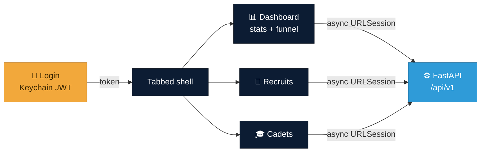

<div align="center">

# 📱 Det 695 — iOS app

**A native SwiftUI client for the Det 695 recruiting backend.** It talks to the
same FastAPI service and OpenAPI contract as the web app
(`../shared/openapi.json`), so the two clients read as one product.


</div>



## What's here

- **Login → tabbed shell** (Dashboard · Recruits · Cadets) with Keychain-backed
  JWT auth and transparent token refresh — the same contract as `web/src/lib/api.ts`.
- **Dashboard** — headline stat tiles + "The Ascent" funnel.
- **Recruits** — searchable list with a stage filter.
- **Cadets** — searchable directory with an active/inactive/graduated filter and
  status dots matching the web palette.

## Layout

```
ios/
  project.yml            XcodeGen spec (generates the .xcodeproj)
  Det695/
    Det695App.swift      @main entry
    Support/             Config (API base URL) + Keychain
    Networking/          APIClient (async URLSession) + APIError
    Models/              Codable types mirroring the OpenAPI schemas
    State/               Session (auth ObservableObject)
    Theme/               Brand palette mirrored from web tokens
    Views/               Root / Login / Dashboard / Recruits / Cadets
```

There is **no committed `.xcodeproj`** — it's generated from `project.yml` so
there's no fragile `pbxproj` to hand-merge.

## Build & run

Requires **Xcode 15+** (iOS 17 deployment target).

```bash
brew install xcodegen        # one-time
cd ios
xcodegen generate           # writes Det695.xcodeproj + Det695/Info.plist
open Det695.xcodeproj        # ⌘R to run in the simulator
```

### Point it at a backend

By default the app calls `http://localhost:8099/api/v1`, which the iOS Simulator
reaches on the Mac host. Start the backend first:

```bash
cd ../backend && uv run uvicorn app.main:app --port 8099
```

Log in with the demo admin: `admin` / `Det695Demo!`.

To target a different backend (e.g. a physical device on your LAN, or a deployed
URL), set the `DET695_API_BASE` environment variable in the Run scheme, e.g.
`http://192.168.1.20:8099/api/v1`. The `Info.plist` already allows insecure
`localhost` HTTP for local development; a deployed backend should be HTTPS.

## Notes

- Models decode with `.convertFromSnakeCase`, so Swift properties are camelCase
  while the JSON stays snake_case — no hand-written `CodingKeys`.
- `RecruitStage` decodes defensively (`.from(_:)` falls back to `.lead`) so an
  unexpected server value never crashes a list.
