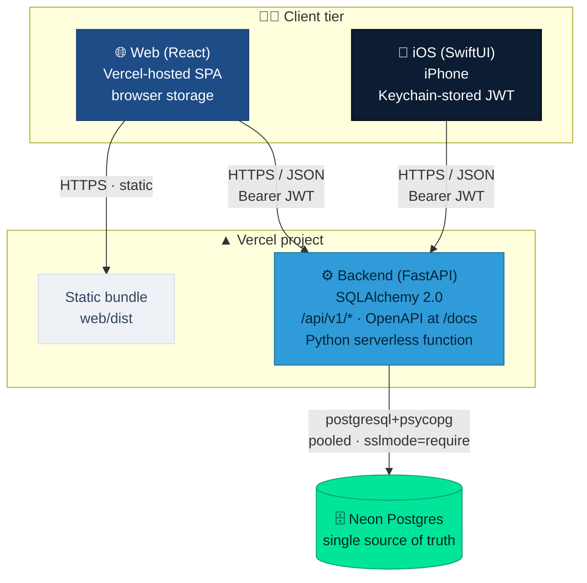
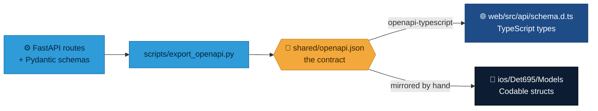

<div align="center">

# 🧭 Architecture

**Three clients. One API. One database.**


</div>

## The system, end to end



Both clients speak HTTPS/JSON to the same API and carry a Bearer JWT. The web bundle and the API are **one Vercel project**; the database is a single Neon instance. There is no per-client backend and no second copy of the data.

## The shared contract

The backend publishes an OpenAPI schema (browsable at `/docs`, exported to `shared/openapi.json`). **Both clients are generated against that one contract** — so the web app (`web/src/lib/api.ts` + generated `web/src/api/schema.d.ts`) and the iOS app (`ios/Det695/Networking`, `ios/Det695/Models`) speak identical request/response shapes.



> Change the API and **both clients change with it.** That is what keeps the two front-ends reading as one product rather than two apps that happen to share a logo.

## Why one database matters

There is exactly one Neon Postgres instance behind everything. An edit made in the web admin, via the API, or through a data migration is instantly visible to every surface — the deployed Vercel API, the browser app, and any phone. There is no per-client cache to reconcile and no local datastore to drift out of sync.

## Auth flow (at a glance)

1. Client `POST`s credentials to `/api/v1/auth/login` and receives a JWT `access_token` (plus a refresh token).
2. The client stores the token — **Keychain** on iOS, browser storage on web — and sends `Authorization: Bearer <token>` on every request.
3. On a 401 the client transparently refreshes and retries, so the user isn't bounced to the login screen mid-session.

Demo admin: `admin` / `Det695Demo!`. **See the full sequence diagrams on [How It Works](How-It-Works).**

## Repository layout

```
afrotc-native-ios/
  backend/     FastAPI service, models, migrations, scripts, tests
  web/         React + TypeScript + Vite app (deploys to Vercel)
  ios/         SwiftUI app (XcodeGen-generated project)
  shared/      openapi.json — the contract both clients build against
  wiki/        this documentation (synced to the GitHub Wiki)
  .github/     backup + restore-drill + sync-wiki workflows
  BACKUP.md    disaster-recovery runbook (see Backups & Recovery)
```

See each surface's page for the internals: [Backend API](Backend-API), [Web App](Web-App), [iOS App](iOS-App), [Database](Database) — and [How It Works](How-It-Works) for the request lifecycle.
