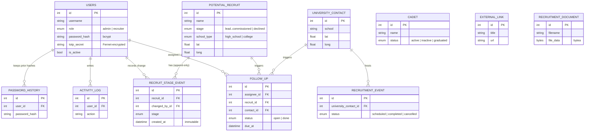
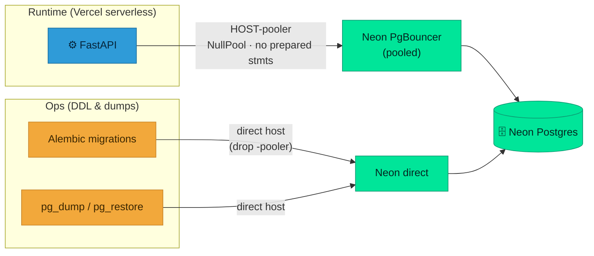

<div align="center">

# 🗄️ Database

**Neon Postgres is the single source of truth.**


</div>

There is no local/SQLite fallback — `config.py` rejects any `DATABASE_URL` that isn't a `postgresql` URL.

## The entity model (11 tables)



<div align="center"><sub>Enums are stored as strings; a <code>TimestampMixin</code> adds tz-aware UTC <code>created_at</code> / <code>last_modified</code> to every row.</sub></div>

| Table | Model | Purpose |
|---|---|---|
| `users` | `User` | accounts, roles, password policy fields, Fernet-encrypted TOTP secret |
| `password_history` | `PasswordHistory` | prior password hashes (reuse prevention) |
| `activity_log` | `ActivityLog` | audit trail of mutating actions |
| `potential_recruit` | `PotentialRecruit` | recruits; `stage` funnel field; lat/long for the map |
| `recruit_stage_event` | `RecruitStageEvent` | **immutable, append-only** stage-change log — source of truth for funnel/trend analytics |
| `cadet` | `Cadet` | enrolled cadets; `status` active/inactive/graduated |
| `university_contact` | `UniversityContact` | school/POC contacts; lat/long |
| `recruitment_event` | `RecruitmentEvent` | outreach events; linked to a contact |
| `external_link` | `ExternalLink` | Materials library links |
| `recruitment_document` | `RecruitmentDocument` | Materials documents; bytes in `file_data` (bytea) |
| `follow_up` | `FollowUp` | tasks tied to a recruit or contact, with assignee |

**Enums** (`app/models/enums.py`): `UserRole` (admin/recruiter), `SchoolType` (high_school/college), `RecruitStage` (lead → contacted → applied → enrolled → commissioned, plus declined), `FUNNEL_ORDER` (excludes declined), `CadetStatus` (active/inactive/graduated), `EventStatus` (scheduled/completed/cancelled), `FollowUpStatus` (open/done).

## The funnel is an event stream

Every stage change writes a `recruit_stage_event` row, so analytics are derived from **history** rather than a single mutable field. This is the heart of the model — see the [funnel state machine on How It Works](How-It-Works#4--the-recruiting-funnel-state-machine).

## Connections: pooled vs. direct

Neon exposes two endpoints, and this app uses both deliberately.



- **Runtime** uses the **pooled** endpoint (`HOST-pooler`, driver `postgresql+psycopg://`, `sslmode=require`). The engine uses `NullPool` and disables psycopg3 prepared statements so it plays nicely with Neon's PgBouncer transaction pooling — important in Vercel's serverless environment.
- **Migrations / DDL and `pg_dump`** run against the **direct, non-pooled** host (drop the `-pooler`). Pooled connections aren't appropriate for DDL or dumps.

Connection strings are never committed — placeholders in `.env.example`, real values in Vercel env vars and the `BACKUP_DATABASE_URL` GitHub Actions secret.

## Migrations (Alembic)

The schema is owned **entirely by Alembic** — the app never creates tables.

```bash
# against the DIRECT (non-pooled) host
DATABASE_URL="postgresql://…@HOST/neondb?sslmode=require" \
  uv run alembic upgrade head
```

Migrations live in `backend/alembic/versions/` (the initial revision creates all 11 tables).

## Seeding & data scripts (`backend/scripts/`)

- **`seed_demo.py`** — seeds reference data: the real Det 695 Pacific-Northwest schools, contacts, and cadets (geocoded for the Territory map), plus demo recruits/events with backdated stage events. **Real, regional data only.**
- **`migrate_from_neon.py`** — one-time legacy Flask→FastAPI migration; maps old free-text `status` to the new `stage` enum and seeds a baseline stage event.
- **`migrate_materials.py`** — backfills document `file_data` bytes; idempotent, `--dry-run` / `--force`.
- **`migrate_materials_from_r2.py`** — materials-only migration pulling document bytes from the legacy Vercel Blob into Postgres `file_data`.
- **`export_openapi.py`** — regenerates `shared/openapi.json`, the contract that feeds the web TypeScript client and the iOS Swift models.

## Recovery

Data protection (nightly dumps, the weekly restore drill, and the real-recovery runbook) is on its own page: **[Backups & Recovery](Backups-and-Recovery)**.
