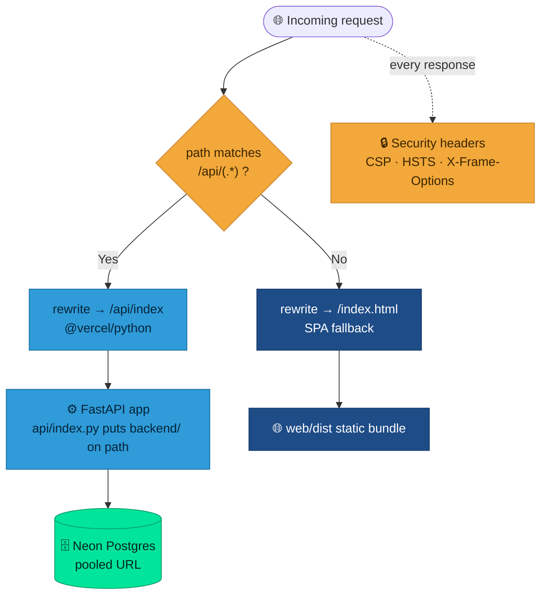
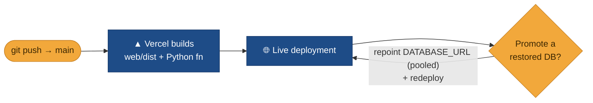

# ▲ Deployment

**Web + API ship together on Vercel; data lives in Neon.**

iOS is distributed separately (see [iOS App](iOS-App)).

## One Vercel project, two things

The repo-root `vercel.json` builds the web bundle **and** wires the API as a Python serverless function. Requests split at the edge:

- **Build**: `installCommand` `cd web && npm install`, `buildCommand` `cd web && npm run build`, `outputDirectory` `web/dist`, `framework: null`.
- **Rewrites**:
  - `/api/(.*)` → `/api/index` — the FastAPI app, run via `@vercel/python`. `api/index.py` puts `backend/` on the path and exposes `app`. Its Python deps come from the root `requirements.txt` (pinned resolved versions).
  - `/((?!api/).*)` → `/index.html` — SPA fallback so client-side routes work.

## Security headers

Set on every response in `vercel.json`:

- **CSP** — `default-src 'self'`, `object-src 'none'`, `frame-ancestors 'none'`, `script-src 'self'`; allowances for Google Fonts (style/font) and CARTO basemaps (`img-src` / `connect-src https://*.basemaps.cartocdn.com`) for the MapLibre Territory view; `worker-src`/`child-src blob:`.
- **HSTS** `max-age=63072000; includeSubDomains; preload`, `X-Content-Type-Options: nosniff`, `X-Frame-Options: DENY`, `Referrer-Policy: strict-origin-when-cross-origin`, a restrictive `Permissions-Policy`, and `Cross-Origin-Opener-Policy: same-origin`.

## Environment (set in the Vercel dashboard, never in the repo)

- `DATABASE_URL` — the Neon **pooled** connection string (`…-pooler…?sslmode=require`, driver `postgresql+psycopg://`).
- `SECRET_KEY`, `ENCRYPTION_KEY` — JWT signing and TOTP-secret encryption.
- `BOOTSTRAP_ADMIN_*` — first-run admin seed (only used when `users` is empty).
- `CORS_ORIGINS`, `CRON_SECRET`, and the storage/upload settings as needed.

Migrations are **not** run by the build — apply Alembic against the **direct** (non-pooled) host before/after deploy as needed (see [Database](Database)).

## Deploy flow

Vercel builds on push to the connected branch. To promote a restored database, repoint `DATABASE_URL` (pooled) and redeploy — see [Backups & Recovery](Backups-and-Recovery).

> **Neon branch hygiene:** the Neon–Vercel integration can create a database branch per preview deploy. Prune stale per-deploy branches periodically (and consider disabling auto-branch creation) from the Neon console to keep the project tidy on the free plan.
