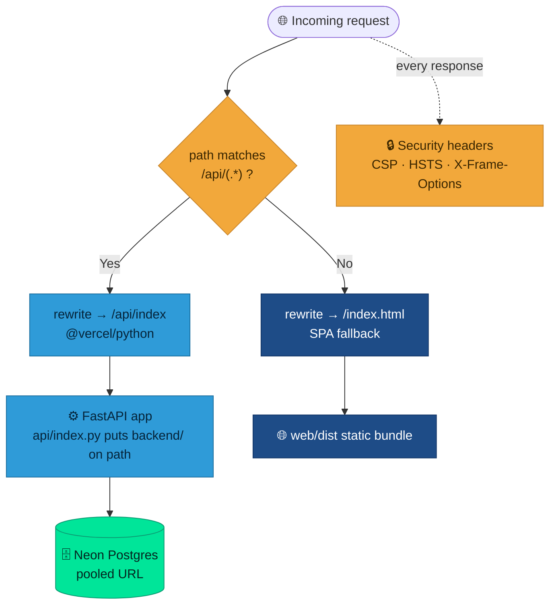
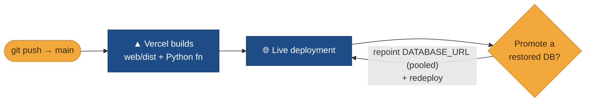

<div align="center">

# ▲ Deployment

**Web + API ship together on Vercel; data lives in Neon.**


</div>

iOS is distributed separately (see [iOS App](iOS-App)).

## One Vercel project, two things

The repo-root `vercel.json` builds the web bundle **and** wires the API as a Python serverless function. Requests split at the edge:


```mermaid
flowchart TD
    REQ(["🌐 Incoming request"]) --> Q{"path matches<br>/api/(.*) ?"}
    Q -->|"Yes"| PY["rewrite → /api/index<br>@vercel/python"]
    PY --> APP["⚙️ FastAPI app<br>api/index.py puts backend/ on path"]
    APP --> DB[("🗄️ Neon Postgres<br>pooled URL")]
    Q -->|"No"| SPA["rewrite → /index.html<br>SPA fallback"]
    SPA --> BUNDLE["🌐 web/dist static bundle"]

    REQ -.->|"every response"| HDR["🔒 Security headers<br>CSP · HSTS · X-Frame-Options"]

    classDef edge fill:#f2a83b,stroke:#c9852a,color:#3a2600
    classDef api fill:#2f9bd8,stroke:#1c6fa0,color:#05243a
    classDef web fill:#1e4c87,stroke:#16396a,color:#ffffff
    classDef db fill:#00E599,stroke:#0c9b73,color:#04241f
    class Q,HDR edge
    class PY,APP api
    class SPA,BUNDLE web
    class DB db
```

- **Build**: `installCommand` `cd web && npm install`, `buildCommand` `cd web && npm run build`, `outputDirectory` `web/dist`, `framework: null`.
- **Rewrites**:
  - `/api/(.*)` → `/api/index` — the FastAPI app, run via `@vercel/python`. `api/index.py` puts `backend/` on the path and exposes `app`. Its Python deps come from the root `requirements.txt` (pinned resolved versions).
  - `/((?!api/).*)` → `/index.html` — SPA fallback so client-side routes work.

## Security headers

Set on every response in `vercel.json`:

- **CSP** — `default-src 'self'`, `object-src 'none'`, `frame-ancestors 'none'`, `script-src 'self'`; allowances for Google Fonts (style/font) and CARTO basemaps (`img-src` / `connect-src https://*.basemaps.cartocdn.com`) for the MapLibre Territory view; `worker-src`/`child-src blob:`.
- **HSTS** `max-age=63072000; includeSubDomains; preload`, `X-Content-Type-Options: nosniff`, `X-Frame-Options: DENY`, `Referrer-Policy: strict-origin-when-cross-origin`, a restrictive `Permissions-Policy`, and `Cross-Origin-Opener-Policy: same-origin`.

## Environment (set in the Vercel dashboard, never in the repo)

- `DATABASE_URL` — the Neon **pooled** connection string (`…-pooler…?sslmode=require`, driver `postgresql+psycopg://`).
- `SECRET_KEY` — JWT signing. `ENCRYPTION_KEY` (Fernet) is used only by the **dormant TOTP scaffold** (encrypting `totp_secret` at rest) and is optional for the active email-2FA path.
- `RESEND_API_KEY`, `RESEND_FROM_EMAIL` — **required in production** to deliver 2FA codes (and intake notifications) via Resend; if unset, email sending is disabled (fine for local dev).
- **Email-2FA tuning** (all optional, sensible defaults): `OTP_CODE_LENGTH` (6), `OTP_TTL_MINUTES` (10), `OTP_MAX_ATTEMPTS` (5), `OTP_RESEND_COOLDOWN_SECONDS` (60), `OTP_MAX_RESENDS` (3), `TRUSTED_DEVICE_TTL_DAYS` (30), `TRUSTED_DEVICE_COOKIE_NAME`.
- `BOOTSTRAP_ADMIN_*` — first-run admin seed (only used when `users` is empty).
- `CORS_ORIGINS`, `CRON_SECRET`, and the storage/upload settings as needed.

### ⚠️ Migrations are NOT run by the build — apply them yourself

Vercel builds and ships **code only**; it never runs Alembic. Any deploy that
includes a new migration leaves the **production Neon DB one revision behind**
until you apply it by hand. The failure mode is silent at deploy time and only
surfaces when a request first touches the new table/column:

```
psycopg.errors.UndefinedTable: relation "<table>" does not exist
```

→ a **500** on that endpoint. (This bit us once: session-tracking shipped the
`auth_sessions` migration but it wasn't applied, so 2FA `login/verify` 500'd on
the first `INSERT INTO auth_sessions` while the earlier-applied OTP columns still
worked — making it look like a 2FA bug rather than a missing table.)

**Rule for every deploy that adds a migration** (they're additive, so order is forgiving):

```bash
cd backend
# DIRECT (non-pooled) host, and the +psycopg driver (matches prod / works locally)
DATABASE_URL='postgresql+psycopg://USER:PW@HOST.neon.tech/neondb?sslmode=require' \
  uv run alembic upgrade head
# verify: `uv run alembic current` should equal `uv run alembic heads`
```

Get the URL from `vercel env pull` or the Vercel dashboard (drop the `-pooler`
segment for the direct host). See [Database](Database) for connection details.

> **Automated safeguard:** the [`schema-drift`](../.github/workflows/schema-drift.yml)
> GitHub Action compares prod's applied revision against the repo head — on
> migration-touching pushes to `main`, daily, and on demand — and opens a
> `schema-drift` issue (which emails you) when the DB is behind, auto-closing it on
> the next green run. So a lagging DB announces itself instead of 500-ing a user.
> It's read-only and reuses the `BACKUP_DATABASE_URL` secret. You can also run the
> check locally: `cd backend && DATABASE_URL=… uv run python scripts/check_migration_drift.py`.

> **Applied-migration provenance** (why a past schema change exists):
> `6bff7689c532` (applied 2026-08-23) made `activity_log.user_id` **nullable** so
> that **public request-info form** submissions — which have no signed-in user —
> can be recorded in the Activity Log. Before it was applied the submission itself
> still succeeded and the lead was saved (audit logging is best-effort and never
> fails the request); only the audit-log row was silently dropped, so public
> submissions didn't appear in the admin Activity Log.

## Deploy flow


```mermaid
flowchart LR
    PUSH(["git push → main"]) --> VB["▲ Vercel builds<br>web/dist + Python fn"]
    VB --> LIVE["🌐 Live deployment"]
    LIVE --> PROMO{"Promote a<br>restored DB?"}
    PROMO -->|"repoint DATABASE_URL (pooled)<br>+ redeploy"| LIVE

    classDef edge fill:#f2a83b,stroke:#c9852a,color:#3a2600
    classDef web fill:#1e4c87,stroke:#16396a,color:#ffffff
    class PUSH,PROMO edge
    class VB,LIVE web
```

Vercel builds on push to the connected branch. To promote a restored database, repoint `DATABASE_URL` (pooled) and redeploy — see [Backups & Recovery](Backups-and-Recovery).

> **Neon branch hygiene:** the Neon–Vercel integration can create a database branch per preview deploy. Prune stale per-deploy branches periodically (and consider disabling auto-branch creation) from the Neon console to keep the project tidy on the free plan.
