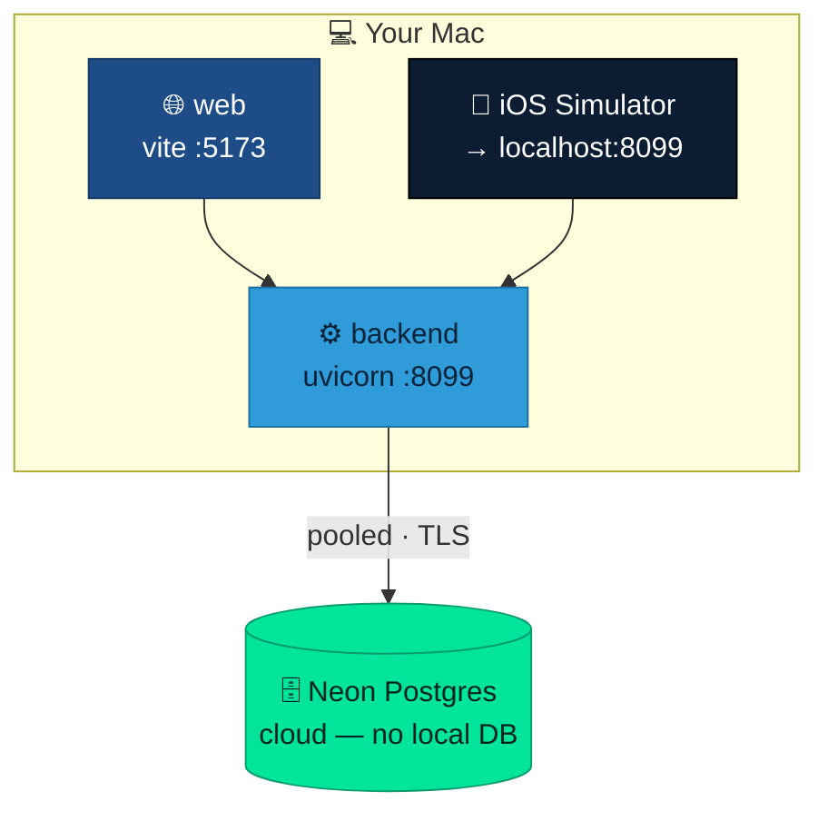
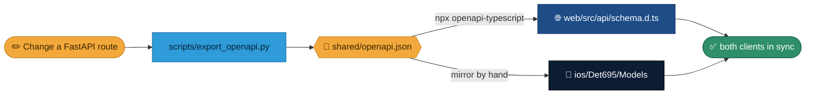

<div align="center">

# 🛠️ Development Process

**How to run the whole product locally and keep the three surfaces in sync.**


</div>

## Local topology



## Prerequisites

- **uv** (Python ≥ 3.11) for the backend
- **Node 20+** and npm for the web app
- **Xcode 15+** and **XcodeGen** (`brew install xcodegen`) for iOS
- A **Neon Postgres** connection string (there is no local DB fallback)
- Postgres client **≥ 17** for backups/restores (`brew install libpq`)

## Run all three

**1. Backend** (port 8099 so the iOS simulator finds it):

```bash
cd backend
cp .env.example .env        # set DATABASE_URL (Neon), SECRET_KEY, ENCRYPTION_KEY,
                            # BOOTSTRAP_ADMIN_PASSWORD
uv sync --extra dev
uv run alembic upgrade head # first time / after schema changes (direct host)
uv run python scripts/seed_demo.py   # optional: real PNW reference data
uv run uvicorn app.main:app --reload --port 8099
```

**2. Web:**

```bash
cd web && npm install && npm run dev     # http://localhost:5173
```

**3. iOS:**

```bash
cd ios && xcodegen generate && open Det695.xcodeproj   # ⌘R
```

Log in everywhere with `admin` / `Det695Demo!`.

## The contract is the hinge

Both clients build against `shared/openapi.json`. When you change the API, regenerate the contract and propagate it — this loop is what keeps the surfaces in lockstep:



```bash
cd backend && uv run python scripts/export_openapi.py   # regenerate the contract
cd ../web && npx openapi-typescript ../shared/openapi.json -o src/api/schema.d.ts
```

Then mirror any new/changed shapes into the iOS `Models/`. Keeping these three in lockstep is what makes the web and iOS apps read as one product.

## Toolchain

- **Backend**: uv, Ruff (lint/format, line length 100, py311), Alembic for schema.
- **Web**: Vite, TypeScript (`tsc -b`), oxlint, `openapi-typescript` codegen.
- **iOS**: XcodeGen (no committed `.xcodeproj` to hand-merge), `xcodebuild`.
- **CI**: GitHub Actions for the nightly backup + weekly restore drill + wiki sync.
- **Hosting**: Vercel (web + serverless API), Neon (Postgres).

## Working rules

- **Commit directly to `main`** — solo repo, `main` is unprotected, no PRs.
- **Never commit secrets.** `.env` / `.env.local` are gitignored; cloud secrets live in Vercel and GitHub Actions.
- **Data is real and Pacific-Northwest.** Seed and reference real Oregon / Washington schools and contacts — never fabricate out-of-region data.
