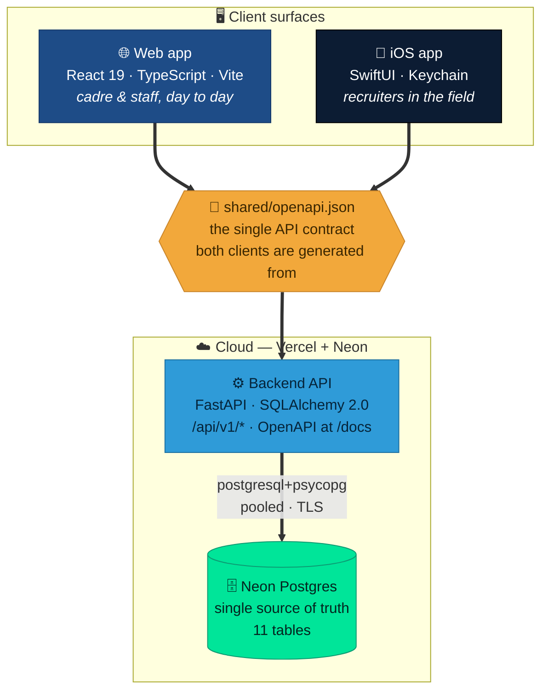

# AFROTC Detachment 695 — Recruiting Command Platform

### One product. Three surfaces. One source of truth.

**A modern recruiting & cadet-management platform for AFROTC Detachment 695** — University of Portland, covering the Pacific Northwest from Seattle to Portland to campuses across Oregon and Washington.

 

  

---

## Why this platform exists

> **Recruiting is a funnel, and funnels leak when the data is scattered.** Spreadsheets on one laptop, contacts in someone's phone, event notes on paper, "who's following up with that lead?" in a group chat. Det 695 runs on **one database, one API, and one contract** — so a recruiter on a phone at a high-school college fair, a cadre member at a desktop, and the analytics dashboard the commander reviews are all looking at *the same truth at the same instant.*

This is a real, deployed system — not a prototype. It ships to production on free-tier infrastructure, backs itself up every night, and **proves its own backups restore** every week.

|  | What it delivers |
|:--:|:--|
| 🎯 | **Full recruiting funnel** — leads climb `lead → contacted → applied → enrolled → commissioned` with an *immutable, append-only* audit trail behind every stage change |
| 🗺️ | **Territory map** of geocoded Pacific-Northwest schools and contacts |
| 📊 | **Live analytics** — funnel conversion, trends, and a commander's dashboard fed from the event stream |
| 📱 | **Native iPhone app** *and* a browser app, built against the **same API contract** — never out of sync |
| 🔒 | **Real security** — JWT auth, bcrypt + password policy, Fernet-encrypted TOTP 2FA, hardened CSP |
| 💾 | **Disaster-ready** — nightly `pg_dump` backups and an automated weekly restore drill that fails loudly if a backup is bad |

## The shape of it — three surfaces, one truth

<b>Change the API once and both front-ends change with it.</b> That is what keeps the web app and the phone reading as <i>one product</i> — not two apps that happen to share a logo.

## See it

<table>
  <tr>
    <td width="50%"> <b>Commander's dashboard</b> — headline stats + "The Ascent" funnel</td>
    <td width="50%"> <b>Territory map</b> — geocoded PNW schools &amp; contacts</td>
  </tr>
  <tr>
    <td width="50%"> <b>Pipeline</b> — the recruiting funnel, stage by stage</td>
    <td width="50%"> <b>Command navy</b> — full dark mode</td>
  </tr>
</table>

More screens on the <a href="Web-App">Web App</a> page.

## Start here

| Page | What you'll find |
|---|---|
| **[Architecture](Architecture)** | How the three surfaces fit together — the big picture |
| **[How It Works](How-It-Works)** | 🔬 The deep dive — request lifecycle, auth flow, the funnel state machine, import pipeline |
| **[Backend API](Backend-API)** | The FastAPI service — endpoints, auth, security, config |
| **[Web App](Web-App)** | The React/Vite client, its data flow, and the full screenshot gallery |
| **[iOS App](iOS-App)** | The SwiftUI client and how to build it |
| **[Database](Database)** | Neon Postgres — the entity model, migrations, seeding |
| **[Backups & Recovery](Backups-and-Recovery)** | Nightly dumps, the weekly restore drill, the recovery runbook |
| **[Deployment](Deployment)** | How web + API ship to Vercel |
| **[Development Process](Development-Process)** | Running all three surfaces locally |
| **[Testing](Testing)** | What's verified today, and the gaps |
| **[Roadmap](Roadmap)** | What's next |

## Ground rules

- **Neon Postgres is the only runtime datastore.** No local/SQLite fallback in deployed environments — see [Backups & Recovery](Backups-and-Recovery).
- **Data is real and regional.** Pacific-Northwest schools and contacts only; never seed fictitious out-of-region (e.g. California) data.
- **Secrets never land in the repo.** Connection strings and keys live in `.env` (gitignored) locally and in Vercel / GitHub Actions secrets in the cloud.

 AFROTC Detachment 695 · University of Portland · Pacific Northwest

