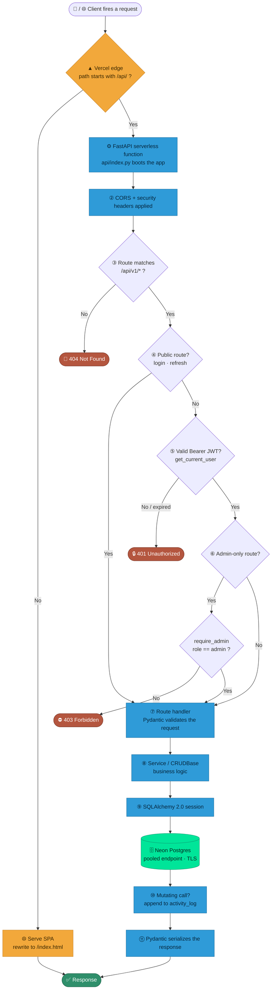
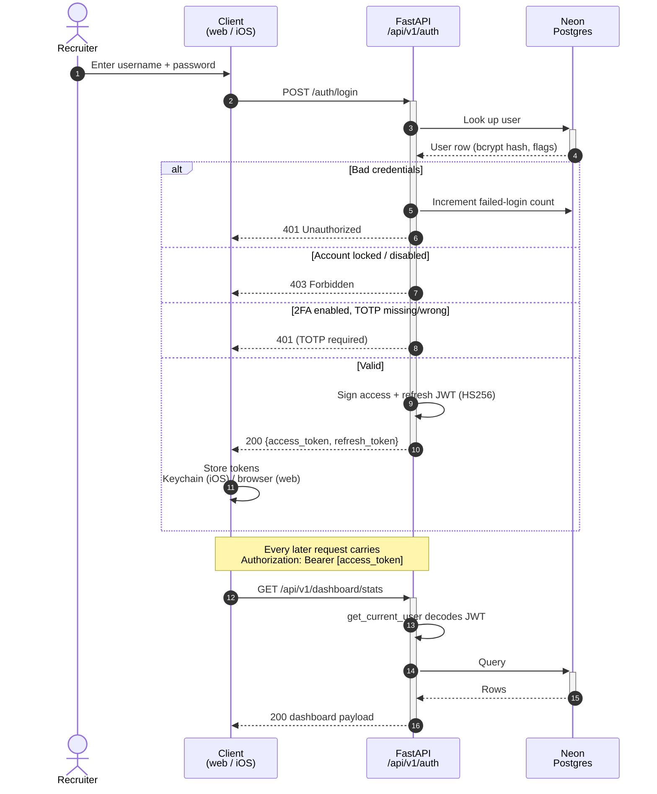
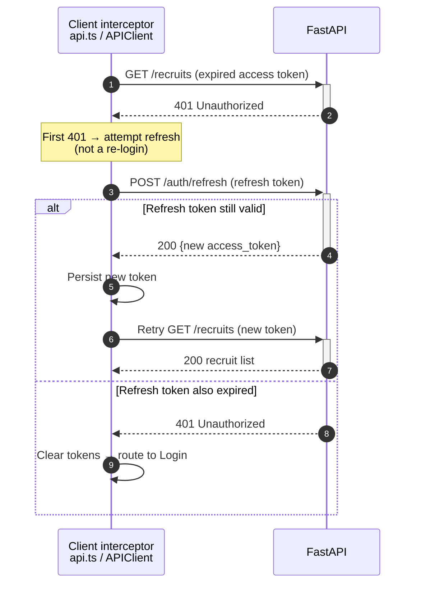
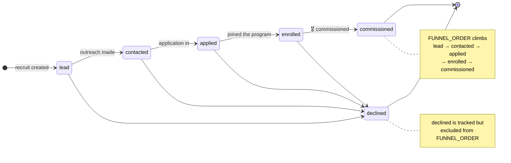
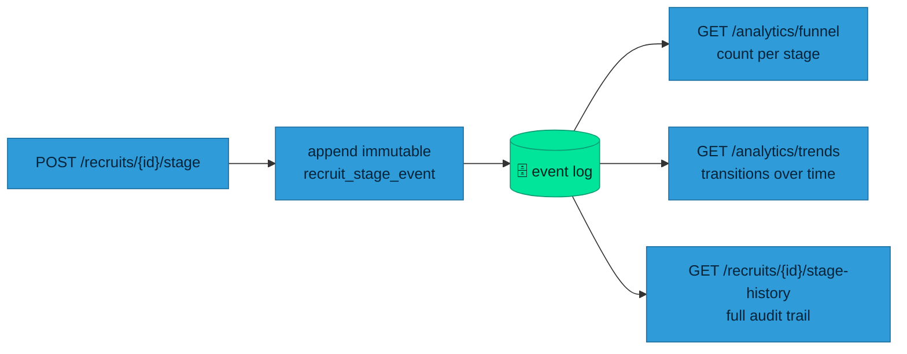
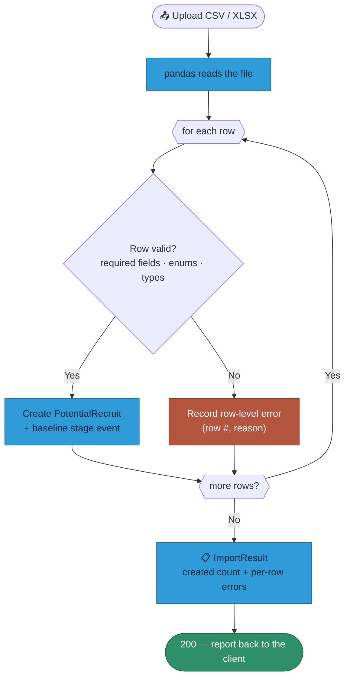

# 🔬 How It Works

**The deep dive.** Follow a single request from a recruiter's phone all the way to a row in Neon Postgres and back — then see how authentication, the recruiting funnel, and bulk import actually behave under the hood.

## Contents

1. [The request flow chart](#1--the-request-flow-chart) — every request, end to end
2. [Authentication sequence](#2--authentication-sequence) — login and the Bearer token
3. [Transparent refresh on 401](#3--transparent-refresh-on-401) — why you're never bounced to login
4. [The recruiting funnel](#4--the-recruiting-funnel-state-machine) — an append-only state machine
5. [The CSV/Excel import pipeline](#5--the-csvexcel-import-pipeline)

---

## 1 · The request flow chart

Every call from either client is the same journey. It enters at the Vercel edge, is routed to either the static web bundle or the FastAPI serverless function, passes an authentication gate (and, for admin routes, an authorization gate), runs a handler that talks to Postgres through SQLAlchemy, and returns JSON. The decision tree below is the whole story on one page.

**Step by step:**

| # | Stage | What happens |
|:--:|---|---|
| ① | **Edge routing** | `vercel.json` rewrites `/api/(.*)` to the Python function; everything else falls through to `index.html` (SPA routing). |
| ② | **CORS + headers** | `CORS_ORIGINS` is enforced; CSP/HSTS/`X-Frame-Options` are set on the response. |
| ③ | **Route match** | All app routes live under `/api/v1`. Meta routes `GET /health` and `GET /` sit outside it. |
| ④ | **Public gate** | Only `POST /auth/login` and `POST /auth/refresh` skip authentication. |
| ⑤ | **Authentication** | `get_current_user` decodes the HS256 JWT with `SECRET_KEY`; missing/expired ⇒ **401**. |
| ⑥–⑦ | **Authorization** | Admin routes add `require_admin`; a non-admin gets **403**. |
| ⑧–⑨ | **Handler → ORM** | Pydantic validates input, the service layer runs the logic, SQLAlchemy 2.0 talks to Neon over the pooled endpoint. |
| ⑩ | **Audit** | Mutating actions append a row to `activity_log`. |
| ⑪ | **Serialize** | The response model shapes the JSON both clients decode against the shared contract. |

---

## 2 · Authentication sequence

A client trades credentials for a short-lived **access token** (~30 min) and a longer **refresh token** (~14 days). The access token rides on every subsequent request as `Authorization: Bearer <jwt>`. On iOS the tokens live in the **Keychain**; on web, in browser storage.

> **Security notes.** Passwords are bcrypt-hashed with a lockout after `MAX_FAILED_LOGINS`, reuse blocked against the last `PASSWORD_HISTORY_SIZE` hashes, and an expiry policy (`PASSWORD_EXPIRY_DAYS`, admins exempt). TOTP 2FA secrets are **Fernet-encrypted at rest** with `ENCRYPTION_KEY` — the app fails closed if that key is unset.

---

## 3 · Transparent refresh on 401

Access tokens are deliberately short-lived. Rather than bounce a recruiter to the login screen mid-session, both clients catch the first **401**, silently exchange the refresh token for a fresh access token, and **replay the original request once**. The user never notices.

---

## 4 · The recruiting funnel (state machine)

A recruit isn't a mutable "status" field you overwrite. It's a **state machine backed by an append-only event log**. Every stage change writes an *immutable* `recruit_stage_event` row — so the funnel and trend analytics are **derived from history**, not from a single field that loses its past the moment it changes.

**Why an event stream?** Because the questions the commander asks are historical: *How many leads did we convert last month? Where in the funnel do we leak? Which recruiter moved which recruit, and when?* Each `POST /recruits/{id}/stage` appends one event; `GET /analytics/funnel` counts the current position of each recruit, and `GET /analytics/trends` reconstructs transitions over a time window — all from the same immutable log.

---

## 5 · The CSV/Excel import pipeline

Recruiting lists arrive as spreadsheets. `POST /recruits/import` accepts a CSV or Excel upload, validates it **row by row**, and returns an `ImportResult` that reports exactly which rows failed and why — so a bad cell never silently drops a lead, and the good rows still land.

---

Next: the <a href="Backend-API">Backend API reference</a> · the <a href="Database">Database model</a> · or back to <a href="Architecture">Architecture</a>.

