# 🗺️ Roadmap

**Where the platform is, and where it's going.** Not a promise — a living list.

## The arc at a glance

```mermaid
flowchart LR
    subgraph done["✅ Shipped"]
        D1["Three-surface product<br>API · Web · iOS"]
        D2["Full recruiting workflow<br>+ append-only funnel"]
        D3["Analytics + Territory map"]
        D4["Security + backups/restore drill"]
        D5["Det 695 crest everywhere"]
        D6["Backend test suite<br>95 pytest tests, green"]
        D7["iOS ~100% web parity<br>every screen + sub-feature"]
    end
    subgraph next["🔜 Next"]
        N1["Client tests<br>iOS + web coverage"]
        N2["Docs hygiene"]
        N3["Neon branch hygiene"]
    end
    subgraph later["💡 Later / ideas"]
        L1["Richer analytics"]
        L2["iOS push reminders"]
        L4["TestFlight pipeline"]
    end

    done ==> next ==> later

    classDef ok fill:#2f8f6b,stroke:#1c6349,color:#ffffff
    classDef soon fill:#f2a83b,stroke:#c9852a,color:#3a2600
    classDef idea fill:#1e4c87,stroke:#16396a,color:#ffffff
    class D1,D2,D3,D4,D5,D6,D7 ok
    class N1,N2,N3 soon
    class L1,L2,L4 idea
```

## ✅ Done

- Three-surface product live: **FastAPI backend + React/Vite web + SwiftUI iOS**, one Neon Postgres, one OpenAPI contract.
- Full recruiting workflow: recruits with an append-only stage funnel, cadets, university contacts, events, follow-ups, and a Materials library (links + documents stored as Postgres `bytea`).
- Analytics: funnel, trends, and a dashboard stats endpoint feeding both clients.
- Territory map (MapLibre + CARTO) over geocoded PNW schools/contacts.
- Security: JWT auth with refresh, bcrypt passwords with lockout/history/expiry, Fernet-encrypted TOTP 2FA, activity log, and a hardened CSP + header set on Vercel.
- Data protection: nightly `pg_dump` → GitHub Release backups and a weekly automated restore drill.
- Web + iOS both carry the real Detachment 695 crest.
- **iOS ~100% web parity.** Every top-level web screen has an iOS equivalent — Admin, Profile/2FA, bulk import, forgot-password, Territory map, Events calendar — and the within-screen sub-features (charts, chip filters, result counts, richer empty/error/skeleton states, stage-change-with-note, Dashboard/Pipeline chart depth) are all closed. Tracked in the parity audit at `docs/superpowers/specs/2026-07-12-ios-web-parity-audit.md`.
- **Backend test suite:** 95 pytest tests across 15 files, green today — every `/api/v1` endpoint module (auth, funnel, cadets, contacts, events, follow-ups, materials, imports, exports, analytics, profile/2FA), plus admin guardrails and the read-only viewer role. See [Testing](Testing).

## 🔜 Next

- **Client tests.** The backend is well covered; add iOS `*Tests.swift` and web unit/component tests so the two clients aren't relying solely on the smoke affordance and screenshot pipeline. See [Testing](Testing).
- **Docs hygiene.** Root README + per-surface READMEs kept current; retire the leftover Vite starter template content in `web/`.
- **Neon branch hygiene.** Prune per-deploy Neon branches and consider disabling auto-branch creation in the Neon–Vercel integration to stay tidy on the free plan.

## 💡 Later / ideas

- Richer analytics (per-recruiter, per-school conversion; event ROI).
- Push notifications / reminders for due follow-ups on iOS.
- App Store / TestFlight distribution pipeline for the iOS client.

## 🚧 Non-goals / constraints

- **No paid infrastructure** unless clearly justified — free Neon + Vercel + GitHub Actions is the operating envelope (Vercel Blob is acceptable if needed).
- **Postgres is the only runtime datastore** — no local/SQLite fallback.
- **Pacific-Northwest data only** — never fabricate out-of-region records.
