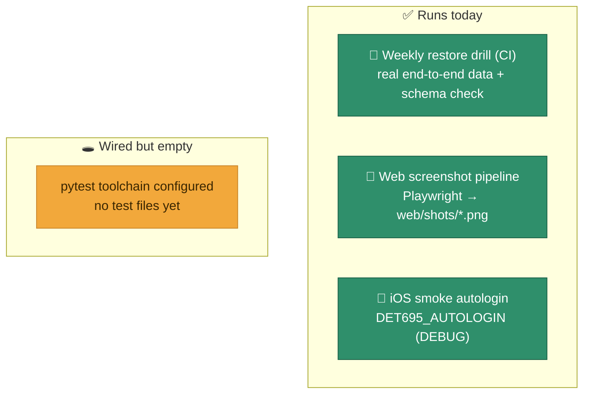

<div align="center">

# ✅ Testing

**An honest snapshot of what's verified today — and where the gaps are.**


</div>

## What's verified, at a glance



## What runs today

- **Restore drill (CI)** — the strongest automated check in the repo. Every Monday `.github/workflows/restore-drill.yml` restores the latest backup into a throwaway Postgres 17 container and asserts all 11 tables exist with sane row counts (and that `users` isn't empty). This is a real end-to-end integrity test of the data + schema. See [Backups & Recovery](Backups-and-Recovery).
- **Web screenshot pipeline** — `web/scripts/*.mjs` (Playwright) drive the app and capture `web/shots/*.png` across pages (dashboard, pipeline, map, etc.), used for visual sanity checks — and for the galleries in this wiki.
- **iOS smoke affordance** — a DEBUG-only `DET695_AUTOLOGIN` env var lets the app auto-login (`admin`/`Det695Demo!`) for quick simulator smoke runs from the CLI.

## What's configured but not yet written

The backend has the **pytest** toolchain wired up in `backend/pyproject.toml` (`pytest`, `pytest-asyncio`, `httpx`, `asyncio_mode="auto"`, `pythonpath=["."]`) but **there are no test files yet** — no `backend/tests/`, no `*Tests.swift`, no web unit/component tests. This is the clearest area to invest in next (see [Roadmap](Roadmap)).

Once tests exist:

```bash
cd backend && uv run pytest          # backend API tests
cd web && npm run lint               # oxlint (static checks today)
```

## Suggested first tests

- **Auth**: login success/failure, lockout after `MAX_FAILED_LOGINS`, refresh flow, password-reuse and expiry policy, TOTP verify.
- **Recruits funnel**: `POST /recruits/{id}/stage` appends an immutable `RecruitStageEvent`; `analytics/funnel` and `analytics/trends` derive correctly from the event stream.
- **Materials**: upload enforces `MAX_UPLOAD_BYTES` (413), download streams the stored bytea.
- **Import**: `POST /recruits/import` returns per-row validation errors.
- **Admin guardrail**: cannot delete the last admin.
