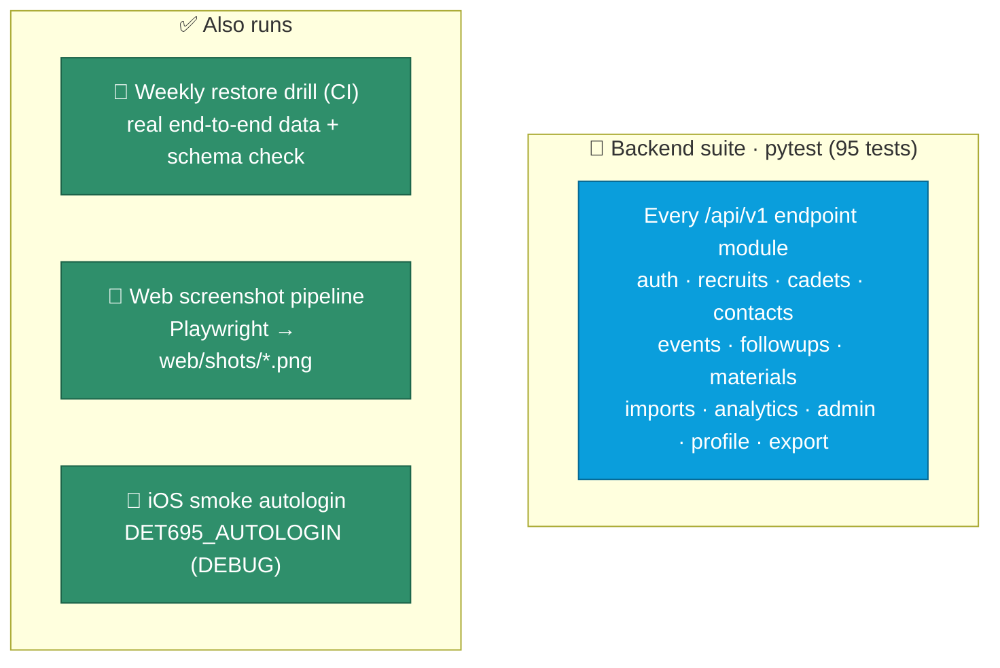

<div align="center">

# ✅ Testing

**An honest snapshot of what's verified today.**


</div>

## What's verified, at a glance



## The backend suite

**95 tests across 15 files** in `backend/tests/`, green today. Run them with:

```bash
cd backend && uv run pytest -q       # 95 passed
uv run ruff check tests/             # lint the suite
```

The harness (`tests/conftest.py`) is the clever part: the app is Postgres-only at runtime, so the conftest sets a dummy `postgresql` `DATABASE_URL` to satisfy config validation, then overrides `get_db` to point at an **in-memory SQLite** database via a shared `StaticPool`. Schema is recreated per-test from the models, and `TestClient(app)` runs *without* the lifespan so bootstrap never fires — each test seeds the users and rows it needs. Result: the whole suite runs with **no live database**.

What's covered:

- **Auth** — login success/failure, lockout after repeated failures, refresh flow, password reuse/expiry policy, and TOTP verification.
- **Recruits funnel** — `POST /recruits/{id}/stage` appends an immutable `RecruitStageEvent`; same-stage transitions are rejected; stage history reads back in order.
- **Cadets · Contacts · Events** — full CRUD, search, and filter coverage with real PNW data.
- **Follow-ups** — CRUD, the `assignee=me` / status / `due_before` filters, and the `/complete` action (including the already-completed guard).
- **Profile & 2FA** — self-service profile edits and the full TOTP setup → verify → disable lifecycle (real `pyotp` codes), plus the per-account `can_enable_2fa` gate.
- **Materials** — upload enforces `MAX_UPLOAD_BYTES` (413), download streams the stored `bytea`.
- **Imports** — `POST /recruits/import` returns per-row validation errors.
- **Exports** — CSV/XLSX/PDF stream for every entity; unknown entity/format is a 422.
- **Analytics, admin guardrails, viewer role** — funnel/trends math, "cannot delete the last admin", and the read-only `require_write` gate across every mutating endpoint.

## Also runs

- **Restore drill (CI)** — the strongest end-to-end check in the repo. Every Monday `.github/workflows/restore-drill.yml` restores the latest backup into a throwaway Postgres 17 container and asserts all 11 tables exist with sane row counts (and that `users` isn't empty). See [Backups & Recovery](Backups-and-Recovery).
- **Web screenshot pipeline** — `web/scripts/*.mjs` (Playwright) drive the app and capture `web/shots/*.png` across pages (dashboard, pipeline, map, etc.), used for visual sanity checks — and for the galleries in this wiki.
- **iOS smoke affordance** — a DEBUG-only `DET695_AUTOLOGIN` env var lets the app auto-login (`admin`/`Det695Demo!`) for quick simulator smoke runs from the CLI.

## Still open

- **iOS `*Tests.swift`** and **web unit/component tests** — the backend is well covered; the two clients lean on the smoke affordance and screenshot pipeline for now. See [Roadmap](Roadmap).
