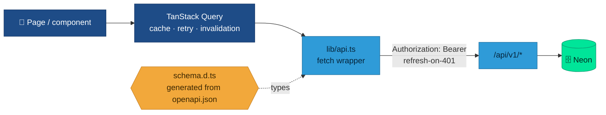

<div align="center">

# 🌐 Web App

**The browser client cadre and staff use day to day.**


</div>

**React 19 + TypeScript + Vite**, deployed to Vercel. It shares the API contract with the iOS app.

## Gallery

<div align="center">
<table>
  <tr>
    <td width="50%"><br><sub><b>Login</b> — the Det 695 crest</sub></td>
    <td width="50%"><br><sub><b>Dashboard</b> — stats + "The Ascent" funnel</sub></td>
  </tr>
  <tr>
    <td><br><sub><b>Recruits</b> — searchable, stage-filtered</sub></td>
    <td><br><sub><b>Pipeline</b> — funnel stage by stage</sub></td>
  </tr>
  <tr>
    <td><br><sub><b>Territory</b> — geocoded PNW map</sub></td>
    <td><br><sub><b>Cadets</b> — active / inactive / graduated</sub></td>
  </tr>
  <tr>
    <td><br><sub><b>Contacts</b> — schools &amp; POCs</sub></td>
    <td><br><sub><b>Events</b> — outreach calendar</sub></td>
  </tr>
  <tr>
    <td><br><sub><b>Follow-ups</b> — tasks by assignee</sub></td>
    <td><br><sub><b>Materials</b> — links + documents</sub></td>
  </tr>
  <tr>
    <td><br><sub><b>Import</b> — CSV / Excel upload</sub></td>
    <td><br><sub><b>Admin</b> — user management + activity log</sub></td>
  </tr>
</table>
</div>

## Stack

- **React 19** with **React Router 7** for routing and **TanStack Query** (`@tanstack/react-query`) for server state / caching.
- **Vite 8** build, **oxlint** for linting.
- **maplibre-gl** for the recruiting **Territory** map.
- **openapi-typescript** generates `src/api/schema.d.ts` from `shared/openapi.json`, so request/response types are always in lockstep with the backend — the same contract the iOS models mirror.
- CSS Modules per component/page; shared design tokens in `src/styles/tokens.css`.

## How data flows



## Layout

```
web/src/
  main.tsx            app entry
  App.tsx             routes + providers
  lib/
    api.ts            fetch wrapper (Bearer JWT, refresh on 401)
    auth.tsx          auth context/provider
    stages.ts         recruit-stage helpers
  api/schema.d.ts     generated OpenAPI types
  components/         AppShell, Insignia (the Det 695 crest), StageChip, TrendArea
  pages/              Login, Dashboard, Recruits, RecruitDetail, Cadets, Contacts,
                      Pipeline, Events, EventDetail, FollowUps, Materials,
                      Territory, ImportRecruits, Profile, Admin
  styles/tokens.css   design tokens (mirrored into the iOS Theme)
  assets/             det695-patch.png (the crest), hero.png
```

## Run locally

```bash
cd web
npm install
npm run dev          # Vite dev server (defaults to http://localhost:5173)
```

Point it at a backend via the API base in `src/lib/api.ts` (or its env var) — run the backend with `uv run uvicorn app.main:app --port 8000` alongside it.

```bash
npm run build        # tsc -b && vite build  → web/dist
npm run lint         # oxlint
```

## Branding

`src/components/Insignia.tsx` renders the real **Detachment 695 patch** (`src/assets/det695-patch.png`) — the same crest the iOS app shows — in the rail header and on the login screen. Design tokens (`src/styles/tokens.css`) define the "Flight Line Operations" palette: cool paper by day, command navy by night, with a single amber **beacon** accent for primary actions.

## Deploy

Ships to Vercel from the repo root `vercel.json` (build `cd web && npm run build`, output `web/dist`). SPA routes fall through to `index.html`; `/api/*` is rewritten to a Python serverless function that runs the FastAPI backend. Security headers (CSP, HSTS, `X-Frame-Options: DENY`, etc.) are set there too. See [Deployment](Deployment).
