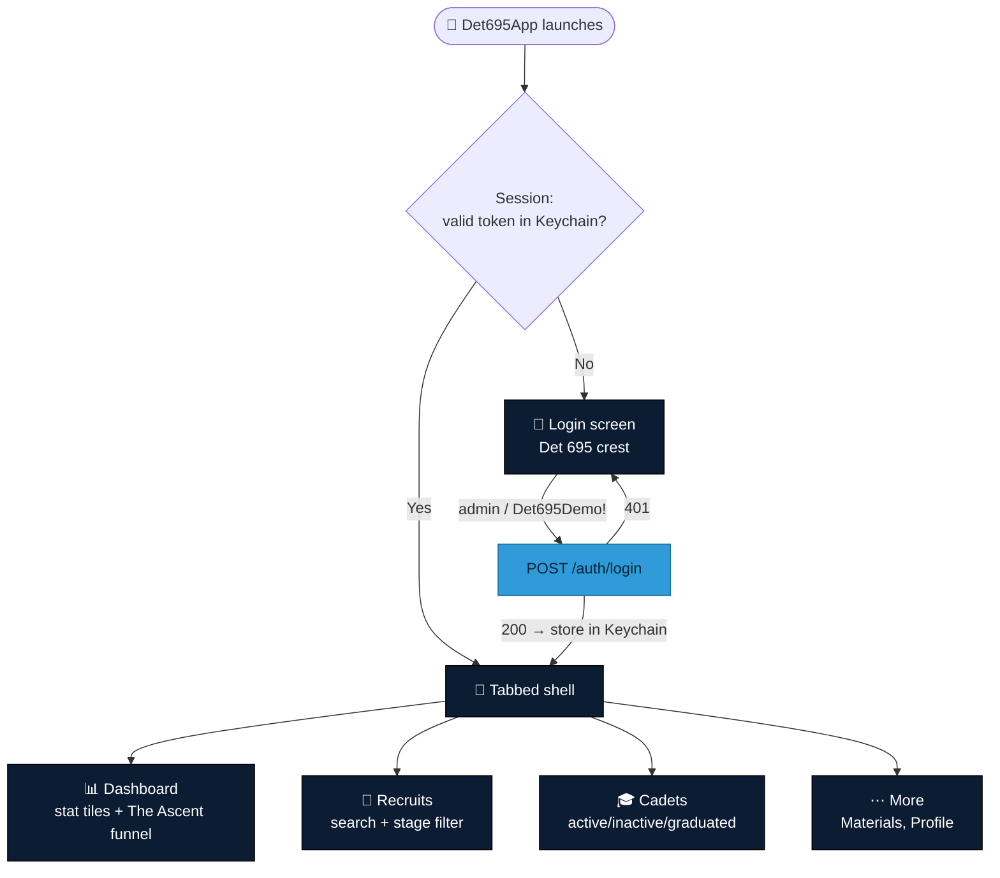

<div align="center">


# 📱 iOS App

**A native SwiftUI client for the Det 695 backend.**


</div>

It talks to the same FastAPI service and the same OpenAPI contract (`shared/openapi.json`) as the web app, so the two clients read as one product.

## Navigation flow



## What's in it

- **Login → tabbed shell** (Dashboard · Recruits · Cadets · More) with **Keychain-backed JWT auth** and transparent token refresh — the same contract as `web/src/lib/api.ts`.
- **Dashboard** — headline stat tiles plus "The Ascent" recruiting funnel.
- **Recruits** — searchable list with a stage filter.
- **Cadets** — searchable directory with an active/inactive/graduated filter and status dots matching the web palette.
- **Materials** — external links + downloadable documents from the backend.
- Branding: the real **Detachment 695 patch** (`DetPatch` image asset) on the login screen and in the brand lockup — the same mark the web app now carries.

## Layout

```
ios/
  project.yml            XcodeGen spec (generates the .xcodeproj)
  Det695/
    Det695App.swift      @main entry
    Support/             Config (API base URL) + Keychain
    Networking/          APIClient (async URLSession) + APIError
    Models/              Codable types mirroring the OpenAPI schemas
    State/               Session (auth ObservableObject)
    Theme/               Brand palette + Insignia/wordmark, mirrored from web tokens
    Views/               Root / Login / Dashboard / Recruits / Cadets / More
    Assets.xcassets/     DetPatch (the crest) and app icon
```

There is **no committed `.xcodeproj`** — it's generated from `project.yml`, so there's no fragile `pbxproj` to hand-merge.

## Build & run

Requires **Xcode 15+** (iOS 17 deployment target).

```bash
brew install xcodegen        # one-time
cd ios
xcodegen generate            # writes Det695.xcodeproj + Det695/Info.plist
open Det695.xcodeproj         # ⌘R to run in the simulator
```

### Point it at a backend

By default the app calls `http://localhost:8099/api/v1`, which the iOS Simulator reaches on the Mac host. Start the backend first:

```bash
cd ../backend && uv run uvicorn app.main:app --port 8099
```

Log in with the demo admin: `admin` / `Det695Demo!`.

To target a different backend (a device on your LAN, or the deployed URL), set the `DET695_API_BASE` environment variable in the Run scheme, e.g. `http://192.168.1.20:8099/api/v1`. `Info.plist` allows insecure `localhost` HTTP for local dev only; a deployed backend must be HTTPS.

## Conventions

- Models decode with `.convertFromSnakeCase`, so Swift properties stay camelCase while the JSON stays snake_case — no hand-written `CodingKeys`.
- `RecruitStage` decodes defensively (`.from(_:)` falls back to `.lead`) so an unexpected server value never crashes a list.
